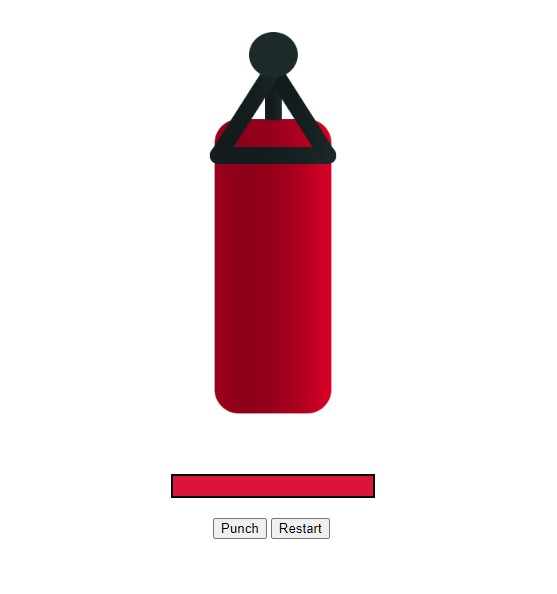
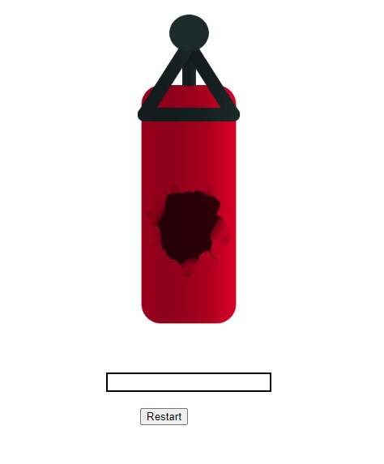

# Punching Bag Game

Note: This is a follow-along solution to a project done by "The Net Ninja" [Tutorial Link](https://www.youtube.com/watch?v=WjfpQlVem-8&list=PL4cUxeGkcC9gQcYgjhBoeQH7wiAyZNrYa&index=14)

## Table of contents

- [Overview](#overview)
  - [The challenge](#the-challenge)
  - [Screenshot](#screenshot)
  - [Links](#links)
  - [Built with](#built-with)
  - [What I learned](#what-i-learned)
- [Acknowledgments](#acknowledgments)

## Overview

Make a simple punching bag game in which the user can punch the bag, the health depletes and the bag eventually bursts.

### The challenge

Users should be able to:

- Punch the bag 
- Reset the game
- See the health go down and the bag burst visually

### Screenshot

### Links

- Solution URL: [Solution](https://github.com/Marcelqayoomtaylor135/punchbag-game)
- Live Site URL: [Live Site](https://main--punchbag-game.netlify.app/)

### Built with

- Semantic HTML5 markup
- CSS custom properties
- Vue 2
- JavaScript

### What I learned

How to seamlessly bind elements together to connect the front and backend to create a dynamic and fun game

## Acknowledgments

Thank you for the challenge, tutorial and assets! (https://www.youtube.com/c/TheNetNinja)
